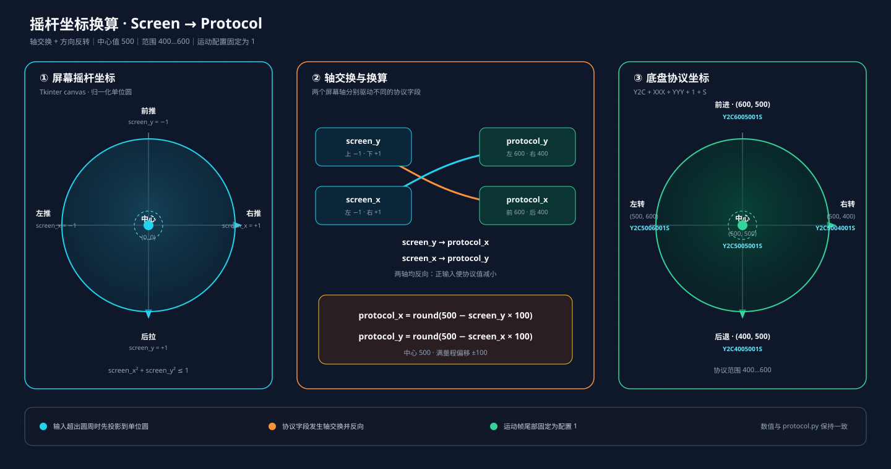

# macOS 智能轮椅 BLE 控制器

这是一个运行在 macOS 上的 Python/Tkinter 桌面程序。它通过 BLE 连接使用 CH9141 的轮椅底盘，在电脑上提供虚拟摇杆、连接状态、通信日志和紧急停止功能。

当前实现依据以下信息整理：

- 供应商 Android APK：`3rd/ToyCar-arm64-v8a-release-v1.0.14-c14.apk`
- 手机 App 与 Mac 探针的实际通信记录
- 轮椅底盘实测日志
- [CH9141 产品资料](https://www.wch.cn/products/CH9141.html)

## 安全警告

> 软件控制不能替代硬件急停、硬件看门狗或电源开关。首次测试以及协议修改后的测试，必须架空驱动轮，并让硬件急停或电源开关保持触手可及。

- 当前尚未确认底盘在通信中断后是否一定会自动停车。
- 不要在人员、宠物、台阶、道路或其他障碍物附近进行首次测试。
- 如果轮子方向、左右轮响应或停车行为异常，应立即松开摇杆并切断硬件电源。
- 本程序固定使用供应商 App 主界面所显示的运动配置 `1`，不提供 1–6 档切换。
- 实车测试中，配置 4 出现过两轮运动异常，配置 5 出现过无响应及 `Y1ES`；不要继续尝试配置 4–6。

## 功能与限制

已实现：

- 扫描附近有名称的 BLE 设备，并优先显示广告中包含 CH9141 `FFF0` 服务的设备。
- 订阅底盘通知并执行三步连接握手。
- 用鼠标拖动圆形虚拟摇杆。
- 以约 100 ms 的周期持续发送摇杆帧，摇杆保持不动时也继续发送。
- 松开鼠标或窗口失焦时回中。
- 紧急停止时连续发送 3 个中心帧，然后断开 BLE。
- 显示握手、响应、运动帧变化和错误日志。
- 收到 `Y1ES` 时停止运动帧并断开连接。

当前限制：

- 只使用固定运动配置 `1`，没有档位切换功能。
- 不访问 CH9141 的 `FFF3` 配置特征。
- 不自动重连。
- 不保证通信中断后的硬件停车行为；这必须由供应商确认并进行独立安全验证。
- 供应商 App 只连接名称符合其过滤条件的设备；本程序没有把名称限制为 `YS`。

## 项目结构

| 文件 | 用途 |
|---|---|
| `app.py` | Tkinter 界面、虚拟摇杆和日志 |
| `ble_controller.py` | BLE 扫描、连接、握手、周期发送和断开 |
| `protocol.py` | UUID、帧编解码和摇杆坐标换算 |
| `run.command` | macOS 启动脚本和依赖检查 |
| `requirements.txt` | Python 依赖 |
| `tests/` | 不需要真实轮椅的自动测试 |
| `tools/phone_ble_probe.swift` | 让 Mac 临时模拟 CH9141 外设，采集手机 App 指令 |
| `3rd/` | 供应商 APK、探针 APK 及参考图片 |

## 环境要求与安装

需要：

- macOS
- Python 3.10 或更高版本
- 与 Python 版本匹配的 Tkinter
- Bleak 3.x

以 Homebrew Python 3.14 为例：

```bash
brew install python@3.14 python-tk@3.14
python3 -m venv .venv
.venv/bin/python -m pip install -r requirements.txt
```

如果使用其他 Python 版本，应安装对应的 `python-tk@主版本.次版本`。例如 Python 3.13 对应 `python-tk@3.13`。

`run.command` 会优先使用项目内的 `.venv/bin/python`，并检查 Python 版本、Tkinter 和 Bleak；它不会自动安装或修改系统环境。

## 启动与基本操作

在项目目录执行：

```bash
./run.command
```

也可以在 Finder 中双击 `run.command`。首次扫描时，macOS 可能请求蓝牙权限；请允许 Terminal、Python 或实际启动程序的终端应用访问蓝牙。权限也可以在“系统设置 → 隐私与安全性 → 蓝牙”中检查。

操作步骤：

1. 确认供应商手机 App 已断开，避免手机和 Mac 同时占用轮椅连接。
2. 点击“扫描”。优先选择名称后带 `★` 的设备；星号表示其广播数据包含 `FFF0` 服务。
3. 点击“连接”，等待状态变为“已就绪”。首次配对时，按轮椅提示在硬件上完成确认。
4. 确认界面显示“原厂固定配置：1”。
5. 在圆形区域按住鼠标并缓慢拖动。圆点位置改变运动方向和幅度。
6. 松开鼠标时摇杆回中；程序继续周期发送中心帧以明确维持停车指令。
7. 点击“紧急停止”会停止周期任务、连续发送 3 个中心帧并断开连接。

## 通信协议

### BLE/GATT 定义

CH9141 在这里用作 BLE 串口透传。应用层帧是无换行符的 ASCII 字符串。

| 类型 | UUID | 方向 | 用法 |
|---|---|---|---|
| 主服务 | `0000fff0-0000-1000-8000-00805f9b34fb` | — | 控制通信服务 |
| 通知特征 | `0000fff1-0000-1000-8000-00805f9b34fb` | 底盘 → Mac | 握手 ACK、运动 ACK 和错误通知 |
| 写入特征 | `0000fff2-0000-1000-8000-00805f9b34fb` | Mac → 底盘 | 握手和运动指令，采用 write-without-response |
| 配置特征 | `0000fff3-0000-1000-8000-00805f9b34fb` | 双向 | CH9141 配置；本程序不访问 |

程序必须先订阅 `FFF1`，再向 `FFF2` 写入握手指令，否则可能错过快速返回的 ACK。

### 连接与握手时序

连接建立并订阅 `FFF1` 后，依次完成三个请求/响应：

```text
Mac / Python                         轮椅底盘
     |                                  |
     |--- FFF2: Y2AS ------------------>|
     |<-- FFF1: Y1AS -------------------|
     |--- FFF2: Y2BS ------------------>|
     |<-- FFF1: Y1BS -------------------|
     |--- FFF2: Y2O3S ----------------->|
     |<-- FFF1: Y1O3S ------------------|
     |                                  |
     |        状态进入“已就绪”            |
```

每一步只有收到对应 ACK 后才进入下一步。当前程序每隔约 500 ms 重发尚未确认的握手请求，总等待时间为 10 秒。任一步超时或收到 `Y1ES`，连接都不会进入“已就绪”状态。

### 通用帧约定

- 编码：ASCII。
- 起始字符：`Y`。
- 结束字符：`S`。
- Mac 发出的控制请求以 `Y2` 开头。
- 底盘返回的通知以 `Y1` 开头。
- 帧之间没有换行符；一个 BLE 数据包可能包含半帧或多帧，因此接收端按 `Y...S` 组帧。

### 已使用的命令与响应

| Mac 发送 | 期望响应 | 当前用途 |
|---|---|---|
| `Y2AS` | `Y1AS` | 握手第 1 步 |
| `Y2BS` | `Y1BS` | 握手第 2 步 |
| `Y2O3S` | `Y1O3S` | 握手第 3 步 |
| `Y2C...S` | 通常观察到 `Y1CS` | 摇杆运动/中心帧 |

`Y1CS` 在实车日志中会随运动帧持续出现，程序会记录它，但不会把每一个运动帧都阻塞等待 `Y1CS`，以免 ACK 延迟导致控制发送频率下降。

### 摇杆运动帧

当前发送格式：

```text
Y2C{protocol_x:03d}{protocol_y:03d}1S
```

字段定义：

| 字段 | 长度 | 取值 | 说明 |
|---|---:|---|---|
| `Y2C` | 3 | 固定 | 摇杆控制帧头 |
| `protocol_x` | 3 | `400..600` | 前后方向对应的协议坐标 |
| `protocol_y` | 3 | `400..600` | 左右方向对应的协议坐标 |
| `1` | 1 | 当前固定为 `1` | 供应商 App 主界面使用的运动配置字段 |
| `S` | 1 | 固定 | 帧结束字符 |

完整帧长度为 11 个 ASCII 字符。例如中心帧：

```text
Y2C5005001S
```

这里的 `X/Y` 是底盘协议字段名称，不等同于屏幕的横轴和纵轴。

### 摇杆坐标系

Tkinter 画布使用屏幕坐标：向右为正 X，向下为正 Y。程序先把鼠标位置归一化到半径为 1 的圆内：

```text
screen_x: 左=-1，中心=0，右=+1
screen_y: 上=-1，中心=0，下=+1
screen_x² + screen_y² <= 1
```

再转换为底盘协议坐标：

```text
protocol_x = round_half_away_from_zero(500 - screen_y * 100)
protocol_y = round_half_away_from_zero(500 - screen_x * 100)
```



由于计算结果始终为正数，这里的 `round_half_away_from_zero` 表现为通常的四舍五入，恰好位于 `.5` 时向较大的整数取整。

关键点：

- 屏幕纵轴 `screen_y` 映射到协议 `protocol_x`。
- 屏幕横轴 `screen_x` 映射到协议 `protocol_y`。
- 两个方向在换算时都取反。
- 中心值为 `500`，满量程范围为 `400..600`。
- 鼠标超出圆形摇杆区域时，会先投影到单位圆边缘，不会产生超出范围的协议值。

### 方向与报文示例

以下示例均使用当前固定运动配置 `1`：

| 摇杆方向 | `screen_x` | `screen_y` | `protocol_x` | `protocol_y` | 完整帧 |
|---|---:|---:|---:|---:|---|
| 中心 | 0 | 0 | 500 | 500 | `Y2C5005001S` |
| 前推到底 | 0 | -1 | 600 | 500 | `Y2C6005001S` |
| 后拉到底 | 0 | +1 | 400 | 500 | `Y2C4005001S` |
| 左推到底 | -1 | 0 | 500 | 600 | `Y2C5006001S` |
| 右推到底 | +1 | 0 | 500 | 400 | `Y2C5004001S` |
| 右前 45° | 约 +0.707 | 约 -0.707 | 571 | 429 | `Y2C5714291S` |

斜向输入受单位圆限制。例如右前 45° 时两个归一化分量约为 `±0.707`，而不是同时达到 `±1`，因此不会得到超出圆形摇杆范围的极端组合。

> 上表记录的是当前代码和既有实测采用的方向定义。如果某个底盘固件的实际方向与表格相反，应停止落地测试并与供应商核对，不要让操作人员临时适应反向控制。

### 发送、保持与停止时序

连接进入“已就绪”后，程序启动一个约 100 ms 周期的发送任务：

- 按住并拖动摇杆：周期发送当前位置对应的运动帧。
- 推到某处保持不动：继续重复发送同一个运动帧，不会因为坐标没有变化而停止。
- 摇杆未按下或松开：周期发送 `Y2C5005001S`。
- 窗口失去焦点：按松开处理，摇杆回中。
- 正常断开：停止周期任务，写入一个中心帧，然后断开 BLE。
- 紧急停止：停止周期任务，以约 50 ms 间隔写入 3 个中心帧，然后断开 BLE。
- 收到 `Y1ES`：立即标记为不可控制、停止周期任务并断开，不再继续发送运动帧。

周期发送用于匹配供应商 App 的持续控制行为，但不能替代底盘自身的通信超时保护。

### 错误与异常响应

| 现象或响应 | 程序行为 | 建议处理 |
|---|---|---|
| 握手 ACK 超时 | 退出握手并断开 | 确认设备、配对状态和手机 App 已断开 |
| `Y1ES` | 停止发送并断开 | 重新连接；若反复出现，停止实车测试并联系供应商 |
| BLE 写入失败 | 尝试发送中心帧并断开 | 确认轮椅是否掉电或超出范围 |
| 远端主动断开 | 状态改为“已断开” | 确认硬件已经停车后再重连 |
| 方向或左右轮异常 | 软件回中并使用硬件急停 | 架空车轮，核对固件和协议版本 |

## `1 speed`、`Y2O3S` 与运动配置 `1`

这三个值不能简单理解成同一个“速度档位”：

1. 供应商 App 主界面显示 `1 speed`，但没有可操作的档位切换按钮。
2. App 和本程序连接时都会执行 `Y2O3S → Y1O3S`。这是建立可控制连接所需的第三步握手；数字 `3` 的准确业务含义尚未得到供应商正式确认。
3. 握手完成后，当前程序的运动帧固定以 `1S` 结尾，例如 `Y2C6005001S`。这里暂称“运动配置字段”，不宣称它一定表示线性速度档位。
4. APK 内包含未从主界面开放的模式页面及 `Y2O1S` 至 `Y2O6S` 相关代码，但这不代表当前轮椅固件安全支持所有值。

因此，本程序保留 `Y2O3S` 握手，同时固定发送运动配置 `1`；界面不提供档位切换。

## 需要与底盘供应商确认并开放的接口

下面两项是智能轮椅项目继续实现可控档位和物理速度控制的前置条件。目前都属于**供应商待办**，不能依据 APK 残留代码或主观车感自行推断。

### 待办 1：开放档位控制信号

请底盘供应商提供当前量产固件正式支持的档位控制接口，并开放给上层控制程序使用。需要交付：

- 设置档位和查询当前档位的完整请求帧、响应帧及示例。
- 合法档位范围、上电默认档位，以及每个档位的准确业务含义。
- 成功 ACK、拒绝、忙状态、非法参数和其他错误响应的定义。
- 档位切换的前置条件：是否必须先回中或发送停止命令。
- 静止时和运动中能否切换；如果不能，底盘应返回什么状态。
- 每个档位对应的最大线速度 `v` 和最大角速度 `ω`。
- 支持该接口的底盘型号、控制器型号和固件版本。

验收标准：

1. 架空驱动轮，依次设置所有声明支持的档位，每次都收到明确的成功或拒绝响应。
2. 查询到的当前档位与最近一次成功设置值一致。
3. 切换过程中不出现左右轮异常、设备失联或非预期 `Y1ES`。
4. 相同摇杆输入在不同档位下的实际限速符合供应商提供的档位定义。

在该接口正式提供并通过验收前，本程序继续固定使用运动配置 `1`，不开放档位按钮。

### 待办 2：提供速度、角速度到摇杆位置的映射表

请底盘供应商逐档提供摇杆协议坐标与底盘物理运动量之间的双向映射：

```text
(protocol_x, protocol_y, gear) ↔ (v, ω)

v：线速度，单位 m/s
ω：角速度，单位 rad/s
```

映射表或计算公式需要包括：

- `protocol_x`、`protocol_y`、`v` 和 `ω` 的正负方向定义。
- 中心死区范围，以及电机开始运动的最小输入阈值。
- 每档最大前进/后退线速度，以及最大左转/右转角速度。
- 中心、直线运动、原地转向、曲线运动和坐标边界的采样点。
- 非采样点采用的插值方法或完整计算公式。
- 输入限幅、输出饱和，以及底盘内部加速和减速限制。
- 实测值允许的误差范围或容差。
- 电池电量、乘员/载荷和固件版本是否会改变映射结果。

建议供应商按以下字段提供机器可读的 CSV 或 XLSX 表格：

| 固件版本 | 档位 | `protocol_x` | `protocol_y` | `v (m/s)` | `ω (rad/s)` | 工况/备注 |
|---|---:|---:|---:|---:|---:|---|
| 示例 | 1 | 500 | 500 | 0 | 0 | 中心点；实际数据由供应商填写 |

验收标准：

1. 从映射表选取中心、轴向、斜向和边界采样点，先架空验证运动方向。
2. 在封闭安全测试场测量实际 `v` 和 `ω`，结果应落在供应商声明的容差内。
3. 给定目标 `(v, ω)` 时，能够唯一地或按供应商明确规定的规则换算为 `(protocol_x, protocol_y, gear)`。
4. 给定摇杆坐标和档位时，能够计算其预期 `v` 和 `ω`，用于上层规划、限速和安全校验。

在取得并验证该映射前，本程序只能发送归一化摇杆位置，不能宣称能够精确控制以 `m/s` 或 `rad/s` 表示的物理速度。

## 证据范围与待确认事项

### 已由代码、APK 或实车日志确认

- 使用 `FFF0` 服务、`FFF1` 通知和 `FFF2` 无响应写入。
- 握手顺序为 `A → B → O3`，每一步等待对应 ACK。
- 运动帧由两个三位十进制坐标、一个配置字段和结尾 `S` 组成。
- 坐标中心是 `500/500`，当前使用范围是 `400..600`。
- 固定位置需要持续发送，当前程序周期约为 100 ms。
- 供应商 App 主界面没有档位切换入口，只显示 `1 speed`。
- 实车会返回 `Y1CS`；错误状态可能返回 `Y1ES`。

### 基于现象和静态分析的解释

- `Y1CS` 很可能是摇杆控制帧的接收确认或控制状态通知。
- 运动帧最后一位与 APK 内部状态值相关，但“速度档位”不是已经确认的正式名称。
- `Y2O3S` 是连接控制流程的一部分，不应仅根据数字 `3` 推断为三档速度。

### 仍需供应商正式确认

- `A`、`B`、`O`、`C`、`W`、`E` 每个命令字母的正式定义。
- `Y2O3S` 中数字 `3` 的正式含义。
- 运动帧最后一位的正式字段名称及合法取值。
- `Y1CS` 和 `Y1ES` 的完整状态定义。
- 底盘失联看门狗的超时时间及能否保证自动停车。
- 不同底盘固件版本的坐标方向和范围是否完全一致。

## 首次实车测试

1. 架空两个驱动轮，确保轮椅不会接触地面移动。
2. 让另一人守在硬件急停或电源开关旁。
3. 关闭供应商手机 App，使用 Mac 连接轮椅。
4. 确认握手结束后首个中心帧为 `Y2C5005001S`。
5. 很小幅度、短时间地测试前、后、左、右；逐项核对轮子方向。
6. 在一个方向保持摇杆，确认日志持续出现相同运动帧。
7. 松开摇杆，确认日志恢复中心帧且驱动轮停止。
8. 拖动时切换到其他窗口，确认失焦回中并停车。
9. 点击“紧急停止”，确认写入中心帧并断开。
10. 单独验证 BLE 意外断开后的底盘行为；如果轮子不停，立即切断电源并联系供应商。

在完成上述测试并取得供应商的安全确认前，不要让轮椅载人落地运行。

## 故障排查

- **扫描不到设备：** 确认轮椅蓝牙已上电、未连接其他手机，并检查 macOS 蓝牙权限。
- **设备存在但没有星号：** 设备可能没有在广播包中公开 `FFF0`，仍可尝试连接；连接后程序会检查实际服务。
- **可以看到设备但连接失败：** 确认轮椅端是否要求首次连接按键确认，并确认没有其他设备占用连接。
- **停在“握手中”：** 检查日志中最后一个 TX 及其对应 RX；关闭供应商 App 后重新连接。
- **等待 `Y1O3S` 超时：** 轮椅可能没有完成硬件确认、仍被其他设备占用，或者通知订阅失败。
- **持续返回 `Y1BS`：** 表示握手尚未进入或完成 O3 阶段；不要开始发送运动指令。
- **收到 `Y1ES`：** 这是控制连接错误。程序会停止并断开；不要在原连接上继续发送。
- **有 `Y1CS` 但轮子不动：** 先核对坐标是否偏离 `500/500`，再架空检查硬件使能和配对状态。
- **提示缺少 Tkinter：** 安装与当前 Python 主/次版本一致的 `python-tk@X.Y`。
- **提示缺少 Bleak：** 执行 `.venv/bin/python -m pip install -r requirements.txt`。
- **方向不正确或两轮动作不一致：** 立即停止落地测试，保留日志并向供应商核对协议和固件版本。

## 自动测试

自动测试不需要真实轮椅：

```bash
python3 -m unittest discover -s tests -v
python3 -m py_compile app.py ble_controller.py protocol.py
```

测试覆盖坐标换算、方向帧、范围限制、分片通知解析、握手顺序、ACK 超时、持续发送、错误断开和紧急停止。

## 对照手机 App 的真实指令

当需要重新确认供应商 App 的真实行为时，可以让 Mac 临时模拟 CH9141 外设。探针只记录手机指令，不连接或控制真实轮椅。

```bash
swift tools/phone_ble_probe.swift --self-test
swift tools/phone_ble_probe.swift
```

探针广播名称为 `YS`，因为供应商 App 会按该名称连接。首次运行时允许 Terminal 访问蓝牙，然后在手机 App 中连接 `YS`，依次测试：

1. 摇杆居中保持 2 秒。
2. 向前推满并保持 2 秒，然后松手。
3. 向后、向左、向右分别重复。
4. 观察 App 是否始终只显示 `1 speed`。

终端会输出写入时间、帧间隔、十六进制数据和可打印 ASCII。macOS 外设 API 不显示手机采用 write 还是 write-without-response；该写入类型来自 APK 对 `writeCharacteristicWithoutResponse` 的静态分析。
